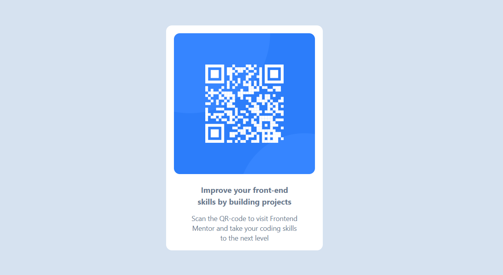

# Frontend Mentor - QR code component solution

This is a solution to the [QR code component challenge on Frontend Mentor](https://www.frontendmentor.io/challenges/qr-code-component-iux_sIO_H). Frontend Mentor challenges help you improve your coding skills by building realistic projects. 

## Table of contents

- [Overview](#overview)
  - [Screenshot](#screenshot)
  - [Links](#links)
- [My process](#my-process)
  - [Built with](#built-with)
  - [What I learned](#what-i-learned)
  - [Continued development](#continued-development)
  - [Useful resources](#useful-resources)
  - [AI Collaboration](#ai-collaboration)
- [Author](#author)
- [Acknowledgments](#acknowledgments)

## Overview

### Screenshot



### Links

- Solution URL: [GitHub - QR Code Component](https://github.com/Ismaellerakotoson/qr-code-component.git)

## My process

### Built with

- Semantic HTML5 markup
- Flexbox
- Mobile-first workflow
- [React](https://reactjs.org/) + [Vite](https://vitejs.dev/) - JS library & build tool
- [Tailwind CSS](https://tailwindcss.com/) - For styles
- [qrcode.react](https://www.npmjs.com/package/qrcode.react) - For QR code generation
- [Docker](https://www.docker.com/) - Containerization for production build and deployment

### What I learned

Working on this project helped me get more comfortable with setting up a React + Vite project from scratch and integrating Tailwind CSS for utility-first styling. Using qrcode.react made QR code generation straightforward — just pass a value prop and the component handles the rest.

Here, I also learned how to use max-w-xs to control text width instead of forcing line breaks with <br>, which results in a cleaner and more responsive layout.

To see how you can add code snippets, see below:

```jsx
import { QRCodeSVG } from 'qrcode.react';

<QRCodeSVG value="https://www.frontendmentor.io" size={150} />

<h1 className="title-color max-w-xs">Improve your front-end skills by building projects</h1>
```

### Continued development

I want to continue improving my skills with Tailwind CSS, especially around responsive design, layout systems, and custom theming.

In React, I also want to deepen my understanding of component-driven development by building more reusable and modular components using React + Vite.

Going forward, I aim to study frontend architecture concepts such as component composition, design patterns (like container/presentational pattern), and better project structuring to build scalable and maintainable applications.

### Useful resources

- https://tailwindcss.com/docs - This official Tailwind CSS documentation helped me understand utility-first styling, layout control (flex, spacing, max-width), and responsive design. I used it throughout this project to build the UI efficiently.

### AI Collaboration

I used ChatGPT during this project to help me improve my React + Tailwind CSS implementation. It helped me debug layout issues, understand better practices (like avoiding `<br>` for layout), and improve responsiveness using utilities like `max-w-xs`.

It was especially useful for:
- Fixing alignment and spacing problems
- Understanding how to properly structure components in React
- Improving my Tailwind CSS workflow

What worked well was getting quick explanations and better solutions for UI issues. It helped me learn more efficient ways to build responsive components.

## Author

- Frontend Mentor - [@Ismaellerakotoson](https://www.frontendmentor.io/profile/Ismaellerakotoson)